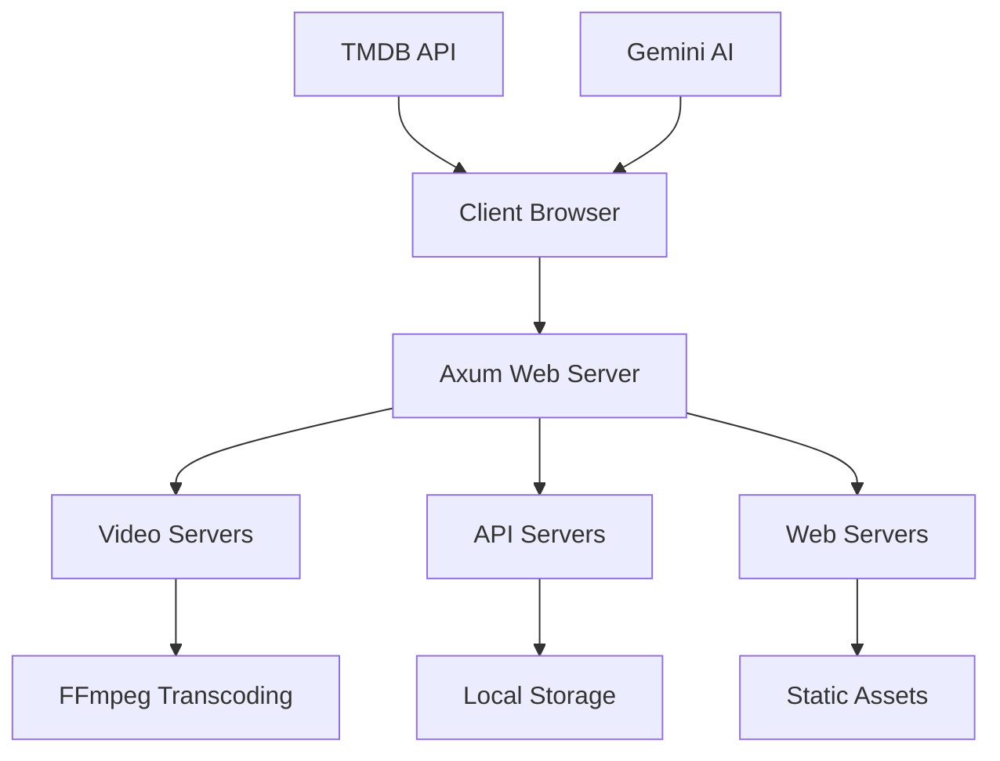

# NexusFlix Documentation Vault

Welcome to the comprehensive documentation for **NexusFlix** - a modern media streaming application with on-the-fly transcoding capabilities.

## 🏗️ Architecture Overview

NexusFlix is built with a **Rust backend** and **JavaScript frontend**, designed for streaming media with real-time transcoding using FFmpeg.

## 📁 Vault Structure

### Core Components
- [[Project Overview]] - High-level project description
- [[System Architecture]] - Detailed architecture breakdown
- [[Technology Stack]] - Technologies and dependencies used

### Backend (Rust)
- [[Backend Overview]] - Rust server architecture
- [[src/video_servers|Video Processing]] - FFmpeg integration and transcoding
- [[API Endpoints]] - REST API documentation
- [[src/api_servers|File Management]] - Local media library handling

### Frontend (JavaScript)
- [[Frontend Overview]] - Modern ES6 modular architecture
- [[UI Components]] - Reusable interface elements
- [[Video Player]] - Custom video streaming player
- [[Theme System]] - Dynamic theming implementation

### Features
- [[public/js/library/local-library-manager|Media Library]]
- [[External APIs]]
- [[public/js/ui/search-handler|Search System]]
- [[Settings Management]]

## 🚀 Quick Start

1. **Prerequisites**: Rust, FFmpeg with NVIDIA support
2. **Environment**: Set `TMDB_API_KEY` and `GEMINI_API_KEY`
3. **Run**: `cargo run -- [port]` (default: 3000)
4. **Access**: `http://localhost:3000`

## 🔗 Key Relationships

- [[Video Processing]] ↔ [[public/js/video-player/video-player|Video Player]]
- [[public/js/library/local-library-manager|Media Library]] ↔ [[External APIs]]
- [[UI Components]] ↔ [[public/js/themes/theme-manager|Theme System]]
- [[API Endpoints]] ↔ [[Frontend Overview]]

---

*This documentation is generated for the NexusFlix media streaming application. Navigate through the linked notes to explore specific components and their relationships.*