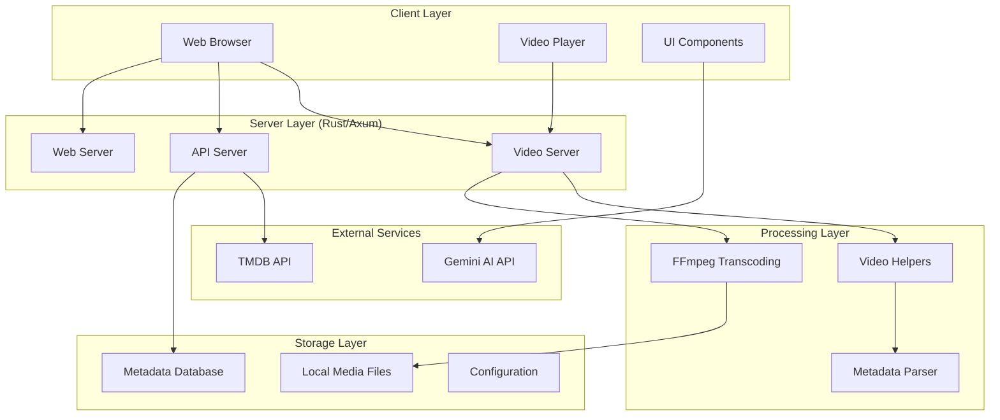
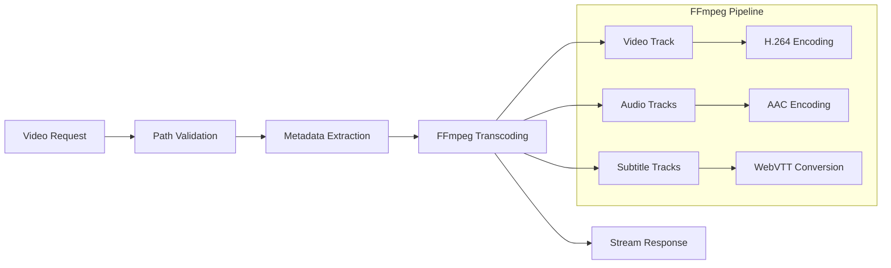
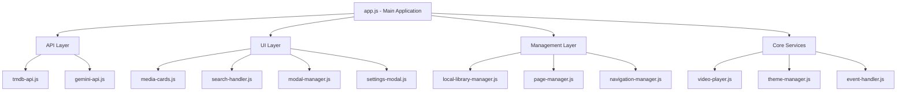
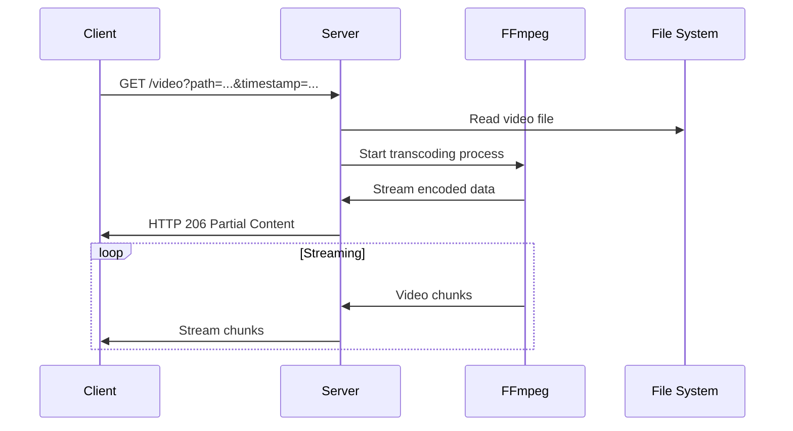
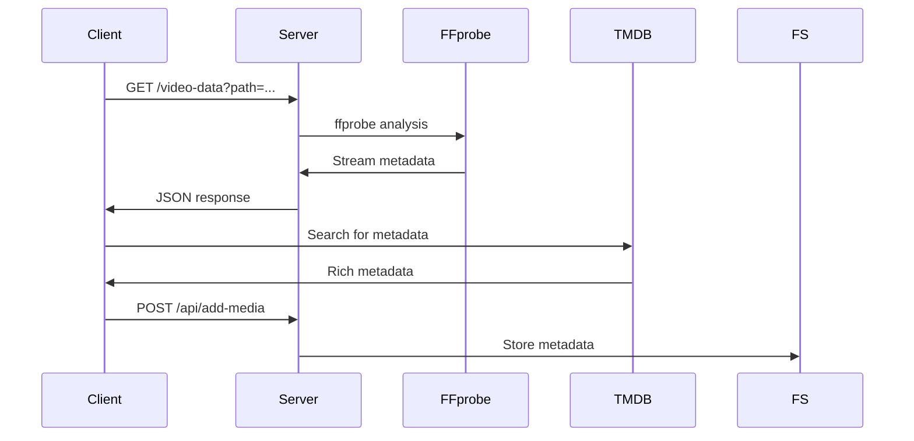

# System Architecture

NexusFlix follows a **modern web application architecture** with clear separation between backend services and frontend presentation layers.

## 🏗️ High-Level Architecture



## 🔧 Backend Architecture

### Core Server (`main.rs`)
The main server orchestrates all components using **Axum framework**:

```rust
// Route organization
Router::new()
    .route("/", get(web_servers::serve_index))
    .route("/video", get(video_servers::serve_video))
    .route("/api/add-media", post(api_servers::add_media))
    // ... additional routes
```

**Key Responsibilities:**
- Route management and HTTP handling
- Environment configuration loading
- API key management
- Static asset serving

### Video Processing Pipeline



### Module Organization

#### 1. **Video Servers** (`video_servers.rs`)
- **Purpose**: Handle video streaming and metadata requests
- **Key Functions**:
  - `serve_video()` - Stream video with transcoding
  - `serve_video_metadata()` - Extract video information
  - `serve_file_list()` - Enumerate media files

#### 2. **API Servers** (`api_servers.rs`)
- **Purpose**: Manage metadata and library operations
- **Key Functions**:
  - `add_media()` - Store media metadata
  - `get_media()` - Retrieve stored metadata
- **Data Structures**:
  - `Meta` - Individual media item metadata
  - `MetaData` - Complete library structure

#### 3. **Web Servers** (`web_servers.rs`)
- **Purpose**: Serve static assets and frontend components
- **Pattern**: Each JavaScript module has dedicated serving function
- **Benefits**: Embedded assets, no external file dependencies

#### 4. **Video Helpers** (`video_helpers.rs`)
- **Purpose**: Core video processing logic
- **Key Components**:
  - `VideoMetadata` - Track and duration information
  - `VideoResponse` - Streaming data structure
  - FFmpeg command orchestration

## 🎨 Frontend Architecture

### Modular JavaScript Design



### Component Communication

**Event-Driven Architecture:**
```javascript
// Cross-component communication
document.addEventListener("contentReload", () => {
    this.pageManager.loadAllContent();
});

document.addEventListener("localLibraryUpdated", () => {
    this.searchHandler.updateLocalData(/* ... */);
});
```

### Data Flow Patterns

1. **API Integration Flow**
   ```
   User Action → API Call → Data Processing → UI Update → Event Emission
   ```

2. **Video Streaming Flow**
   ```
   Play Request → Metadata Fetch → Stream Setup → Progressive Loading
   ```

3. **Library Management Flow**
   ```
   File Discovery → Metadata Enrichment → Local Storage → UI Refresh
   ```

## 🔄 Request Processing Flow

### Video Streaming Request


### Metadata Request


## 🗄️ Data Architecture

### Local Storage Structure
```
~/.local/share/nexus/
├── meta.json          # Media metadata cache
└── config/            # User preferences
    ├── themes.json
    └── settings.json
```

### Metadata Schema
```json
{
  "movies": [
    {
      "id": 12345,
      "title": "Movie Title",
      "poster_path": "/path/to/poster.jpg",
      "genre_ids": [28, 12],
      "vote_average": 8.5
    }
  ],
  "series": [...],
  "fileDatabase": {
    "movie-12345": "/path/to/local/file.mkv"
  }
}
```

## 🔧 Configuration Management

### Environment Variables
- `TMDB_API_KEY` - The Movie Database API access
- `GEMINI_API_KEY` - Google Gemini AI access
- Media directories (hardcoded in current version)

### Runtime Configuration
- Port selection via command line argument
- Theme persistence in localStorage
- User preferences in local storage

---

## Related Documentation
- [[Backend Overview]] - Detailed backend implementation
- [[Frontend Overview]] - Frontend architecture deep dive
- [[Video Processing]] - FFmpeg integration details
- [[API Endpoints]] - Complete API reference