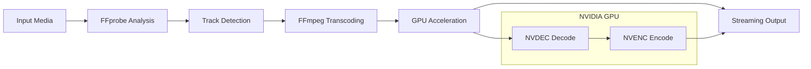

# Technology Stack

NexusFlix leverages modern technologies across backend, frontend, and infrastructure layers to deliver high-performance media streaming capabilities.

## 🦀 Backend Technologies

### Core Framework
- **Rust (2021 Edition)** - Systems programming language for performance and safety
- **Axum 0.8.4** - Modern async web framework built on Tokio
- **Tokio 1.32.0** - Async runtime for concurrent operations
- **Hyper 1.5.1** - HTTP implementation for low-level control

### Key Dependencies

**Web Server & HTTP:**
```toml
axum = "0.8.4"                    # Web framework
tokio = { version = "1.32.0", features = ["full"] }
tokio-util = { version = "0.7.12", features = ["full"] }
hyper = "1.5.1"                   # HTTP implementation
tower-http = { version = "0.6.6", features = ["fs"] }
futures = "0.3.31"                # Async utilities
```

**Serialization & Data:**
```toml
serde = { version = "1.0.215", features = ["derive"] }
serde_json = "1.0.133"            # JSON handling
```

**File System & Utilities:**
```toml
walkdir = "2.5.0"                 # Directory traversal
infer = "0.19.0"                  # MIME type detection
directories = "6.0.0"             # Cross-platform directories
dotenvy = "0.15.7"                # Environment variable loading
```

### Architecture Benefits

**Performance:**
- **Zero-cost abstractions** - Rust's compile-time optimizations
- **Memory safety** - No garbage collection overhead
- **Async I/O** - Non-blocking operations throughout
- **Efficient binary handling** - Direct memory management

**Reliability:**
- **Type safety** - Compile-time error prevention
- **Error handling** - Explicit Result types
- **Concurrent safety** - Built-in thread safety
- **Resource management** - Automatic cleanup

## 🎬 Video Processing Stack

### FFmpeg Integration
- **FFmpeg with NVIDIA Support** - Custom compiled binary
- **Hardware Acceleration** - NVENC/NVDEC for GPU processing
- **Codec Support** - H.264, AAC, WebVTT output formats
- **Streaming Optimization** - Fragmented MP4 for progressive delivery

### Required FFmpeg Features
```bash
# Essential compilation flags
--enable-gpl                      # GPL license for x264/x265
--enable-nonfree                  # Non-free codecs
--enable-nvenc                    # NVIDIA encoding
--enable-nvdec                    # NVIDIA decoding
--enable-cuvid                    # CUDA video interface
--enable-libnpp                   # NVIDIA Performance Primitives
--enable-vaapi                    # Video Acceleration API
--enable-vdpau                    # Video Decode and Presentation API
```

### Video Processing Pipeline


## 🌐 Frontend Technologies

### Core Framework
- **Modern JavaScript (ES6+)** - Native module system
- **No Build Process** - Direct browser execution
- **Component Architecture** - Modular design patterns
- **Event-Driven Communication** - Decoupled components

### UI Framework & Styling
- **Tailwind CSS** - Utility-first CSS framework
- **Custom CSS Variables** - Theme system implementation
- **Responsive Design** - Mobile-first approach
- **CSS Grid & Flexbox** - Modern layout techniques

### External Libraries
```html
<!-- UI Framework -->
<script src="https://cdn.tailwindcss.com"></script>

<!-- Icons -->
<script src="https://unpkg.com/lucide@latest"></script>

<!-- Fonts -->
<link href="https://fonts.googleapis.com/css2?family=Inter:wght@400;500;600;700;800&display=swap" rel="stylesheet">

<!-- Video Player -->
<link href="https://vjs.zencdn.net/8.10.0/video-js.css" rel="stylesheet">
<script src="https://vjs.zencdn.net/8.10.0/video.js"></script>
```

### Module Organization
```javascript
// API Layer
import { TMDBApi } from "./api/tmdb-api.js";
import { GeminiApi } from "./api/gemini-api.js";

// UI Components
import { MediaCardRenderer } from "./ui/media-cards.js";
import { SearchHandler } from "./ui/search-handler.js";
import { ModalManager } from "./ui/modal-manager.js";

// Management Systems
import { LocalLibraryManager } from "./library/local-library-manager.js";
import { PageManager } from "./pages/page-manager.js";
import { NavigationManager } from "./navigation/navigation-manager.js";

// Core Services
import { EventHandler } from "./events/event-handler.js";
import { themeManager } from "./themes/theme-manager.js";
```

## 🔌 External API Integration

### The Movie Database (TMDB)
- **REST API** - Movie and TV show metadata
- **Image CDN** - Posters, backdrops, and thumbnails
- **Rate Limiting** - Client-side queue management
- **Comprehensive Data** - Cast, crew, genres, ratings

**API Endpoints Used:**
```javascript
// Search endpoints
GET /search/movie?query={query}
GET /search/tv?query={query}

// Detail endpoints  
GET /movie/{id}?append_to_response=credits,videos
GET /tv/{id}?append_to_response=credits,videos

// Discovery endpoints
GET /discover/movie?with_genres={genre}&sort_by={sort}
GET /discover/tv?with_genres={genre}&sort_by={sort}

// Trending content
GET /trending/{media_type}/{time_window}

// Genre lists
GET /genre/movie/list
GET /genre/tv/list
```

### Google Gemini AI
- **Generative AI** - Content synopsis generation
- **REST API** - Text generation capabilities
- **Prompt Engineering** - Optimized for media descriptions
- **Error Handling** - Graceful fallbacks for API limits

**API Integration:**
```javascript
// Gemini API endpoint
POST https://generativelanguage.googleapis.com/v1beta/models/gemini-pro:generateContent

// Request format
{
    "contents": [
        {
            "role": "user",
            "parts": [{"text": "Generate synopsis for: Movie Title"}]
        }
    ]
}
```

## 🗄️ Data Storage & Management

### Local Storage Architecture
```
~/.local/share/nexus/
├── meta.json              # Media metadata cache
└── config/                # Future: User preferences
    ├── themes.json
    └── settings.json
```

### Data Formats

**Metadata Storage (JSON):**
```json
{
    "movies": [
        {
            "id": 12345,
            "title": "Movie Title",
            "poster_path": "/path.jpg",
            "genre_ids": [28, 12],
            "vote_average": 8.5,
            "vote_count": 1500
        }
    ],
    "series": [...],
    "fileDatabase": {
        "movie-12345": "/local/path/to/file.mkv"
    }
}
```

**Video Streaming (Binary Protocol):**
- Header with track counts and sizes
- Video data (MP4 container)
- Audio tracks (AAC format)
- Subtitle tracks (WebVTT format)

## 🎨 Theme System Architecture

### CSS Variable System
```css
:root {
    /* Base theme variables */
    --bg-primary: #111827;
    --bg-secondary: #1f2937;
    --text-primary: #f9fafb;
    --accent-primary: #38bdf8;
    --card-radius: 0.75rem;
    --backdrop-blur: none;
}

.theme-glass {
    /* Glass morphism theme */
    --bg-secondary: rgba(30, 30, 30, 0.5);
    --backdrop-blur: blur(20px);
}
```

### Theme Management
- **Dynamic switching** - Runtime theme changes
- **Persistent storage** - localStorage for user preferences
- **CSS custom properties** - Consistent theming across components
- **Special effects** - Glass morphism with backdrop filters

## 🚀 Performance Optimizations

### Backend Performance
- **Async everywhere** - Non-blocking I/O operations
- **Streaming responses** - Progressive data delivery
- **GPU acceleration** - Hardware-accelerated transcoding
- **Memory efficiency** - Process video in chunks

### Frontend Performance
- **No build step** - Direct browser execution
- **Lazy loading** - Components loaded as needed
- **Event delegation** - Efficient DOM event handling
- **Image optimization** - Progressive loading with placeholders

### Network Optimization
- **Partial content** - HTTP 206 for video seeking
- **Rate limiting** - Prevent API quota exhaustion
- **Caching strategies** - Metadata persistence
- **Progressive enhancement** - Core functionality first

## 🔧 Development Tools & Workflow

### Rust Development
```bash
# Development server
cargo run -- 3000

# Release build
cargo build --release

# Dependency management
cargo update
```

### Frontend Development
- **No transpilation** - Direct ES6 module usage
- **Browser DevTools** - Standard debugging workflow
- **Live reload** - Manual refresh during development
- **Module hot swapping** - Individual component updates

### System Requirements

**Development Environment:**
- **Rust 1.70+** - Latest stable Rust toolchain
- **NVIDIA GPU** - GTX 1060 or better with NVENC support
- **CUDA Drivers** - Compatible with GPU generation
- **FFmpeg** - Custom build with NVIDIA codec support

**Runtime Environment:**
- **Linux/Windows/macOS** - Cross-platform Rust support
- **Modern Browser** - ES6 module support required
- **Network Access** - For TMDB and Gemini API calls

---

## Related Documentation
- [[System Architecture]] - How technologies integrate
- [[Backend Overview]] - Rust implementation details
- [[Frontend Overview]] - JavaScript architecture
- [[Video Processing]] - FFmpeg integration specifics