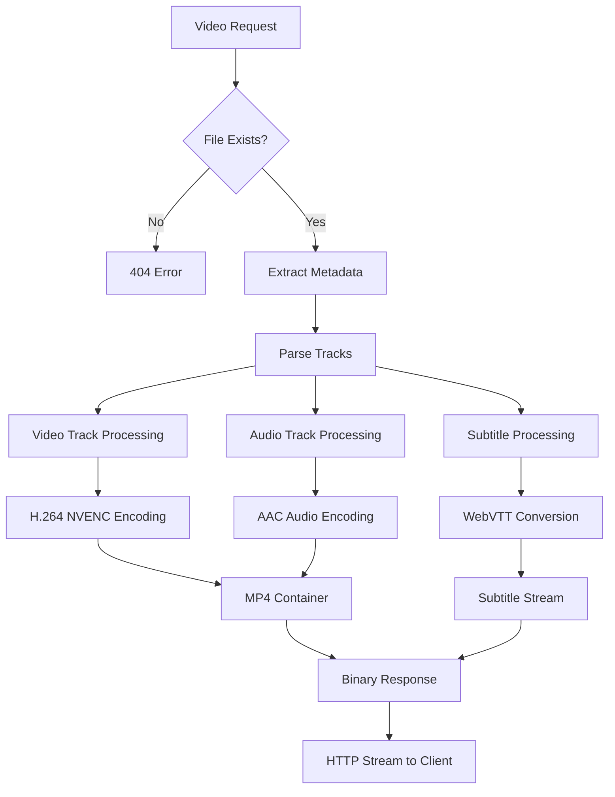

# Video Processing

NexusFlix's video processing system leverages **FFmpeg with NVIDIA GPU acceleration** to provide real-time transcoding and streaming capabilities.

## 🎯 Core Capabilities

### Real-Time Transcoding
- **Hardware acceleration** via NVIDIA NVENC/NVDEC
- **Adaptive streaming** with configurable segments
- **Multi-track support** (video, audio, subtitles)
- **Format conversion** to web-compatible codecs

### Stream Management
- **Partial content delivery** (HTTP 206 responses)
- **Timestamp-based seeking** for precise playback control
- **Progressive loading** for smooth user experience
- **Memory-efficient streaming** without full file loading

## 🏗️ Processing Pipeline



## 🔧 FFmpeg Integration

### Metadata Extraction

**Command Structure:**
```bash
ffprobe -v quiet -print_format json -show_streams [input_file]
```

**Implementation:**
Refer to the `get_video_metadata` function in [[src/video_servers/video_helpers]]. This function executes `ffprobe` to extract detailed stream information and parses the JSON output to identify video, audio, and subtitle tracks. It also handles the detection of unsupported subtitle formats and external subtitle files.

**Track Detection Logic:**
The logic for parsing streams and detecting track types is integrated within the `get_video_metadata` function in [[src/video_servers/video_helpers]]. It categorizes tracks into `Video`, `Audio`, and `Subtitle` types, and identifies graphic-based subtitles that cannot be transcoded.

### Video Transcoding

**NVIDIA Hardware Acceleration:**
Refer to the `get_video` function in [[src/video_servers/video_helpers]]. This function executes `ffmpeg` with NVIDIA hardware acceleration to transcode video segments to H.264, suitable for streaming. It utilizes `h264_nvenc` for encoding and `cuda` for hardware acceleration, ensuring efficient real-time processing.

### Audio Processing

**Multi-Track Audio Support:**
Refer to the `get_audio` function in [[src/video_servers/video_helpers]]. This function handles the transcoding of individual audio tracks, allowing for multi-track audio support and dynamic switching between them.

### Subtitle Processing

**WebVTT Conversion:**
Refer to the `get_subtitle` function in [[src/video_servers/video_helpers]]. This function converts subtitle tracks (both embedded and external) into the WebVTT format, which is compatible with web-based video players.
Refer to the `get_subtitle` function in [[src/video_servers/video_helpers]]. This function converts subtitle tracks (both embedded and external) into the WebVTT format, which is compatible with web-based video players.

## 📊 Data Structures

### Video Response Format
Refer to the `VideoResponse` struct and its `as_bytes` implementation in [[src/video_servers/video_helpers]]. This binary protocol defines how video, audio, and subtitle data are packaged and sent from the backend to the frontend for efficient streaming.

### Track Type System
Refer to the `Tracktype` enum and `Track` struct in [[src/video_servers/video_helpers]]. These data structures are used to represent the different types of media tracks (video, audio, subtitle) and their associated metadata.

## 🚀 Performance Optimizations

### GPU Acceleration Benefits
- **NVENC encoding** - Hardware H.264 encoding
- **NVDEC decoding** - Hardware-accelerated input decoding
- **Parallel processing** - Multiple streams simultaneously
- **Reduced CPU usage** - Offload to dedicated hardware

### Streaming Architecture
- **Progressive delivery** - Start playback before full transcode
- **Memory efficiency** - Process in chunks, not full files
- **Async operations** - Non-blocking I/O throughout pipeline
- **Partial content** - HTTP 206 for seek operations

### FFmpeg Optimizations
```bash
# Fast preset for real-time encoding
-preset fast

# Fragmented MP4 for streaming
-movflags frag_keyframe+empty_moov

# Hardware acceleration
-hwaccel cuda

# Optimized pixel format
-pix_fmt yuv420p
```

## 🔧 Configuration Requirements

### FFmpeg Compilation
Custom FFmpeg build required with:
- **NVIDIA codec support** (--enable-nvenc, --enable-nvdec)
- **CUDA integration** (--enable-cuda, --enable-cuvid)
- **Hardware acceleration** (--enable-vaapi, --enable-vdpau)

### System Requirements
- **NVIDIA GPU** with NVENC/NVDEC support
- **CUDA drivers** properly installed
- **FFmpeg binary** named `ffmpeg-next` in PATH

### Supported Formats

**Input Formats:**
- Video: MP4, MKV, AVI, MOV, WebM
- Audio: AAC, MP3, AC3, DTS, FLAC
- Subtitles: SRT, ASS, SSA, VTT

**Output Formats:**
- Video: H.264 (MP4 container)
- Audio: AAC (ADTS format)
- Subtitles: WebVTT

---

## Related Documentation
- [[Backend Overview]] - Server architecture context
- [[Video Player]] - Frontend video handling
- [[API Endpoints]] - Video streaming endpoints
- [[System Architecture]] - Overall system design